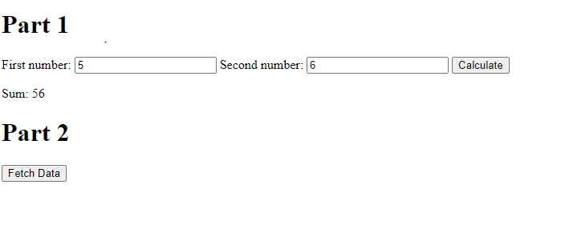
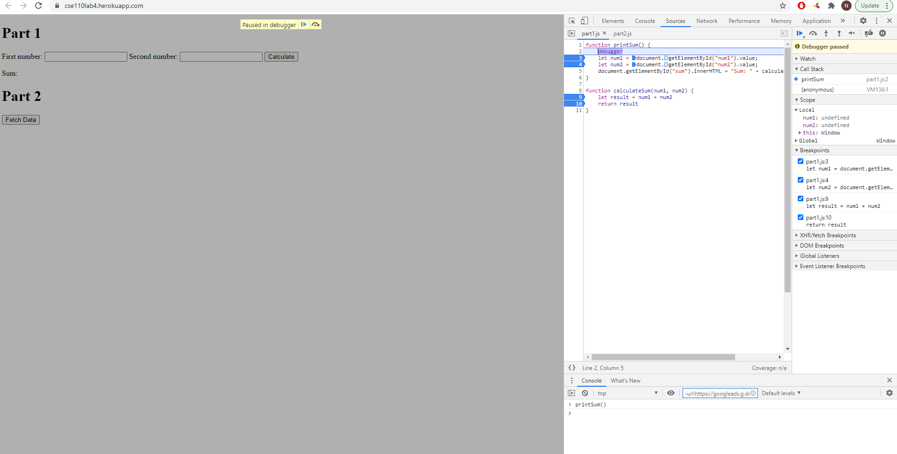
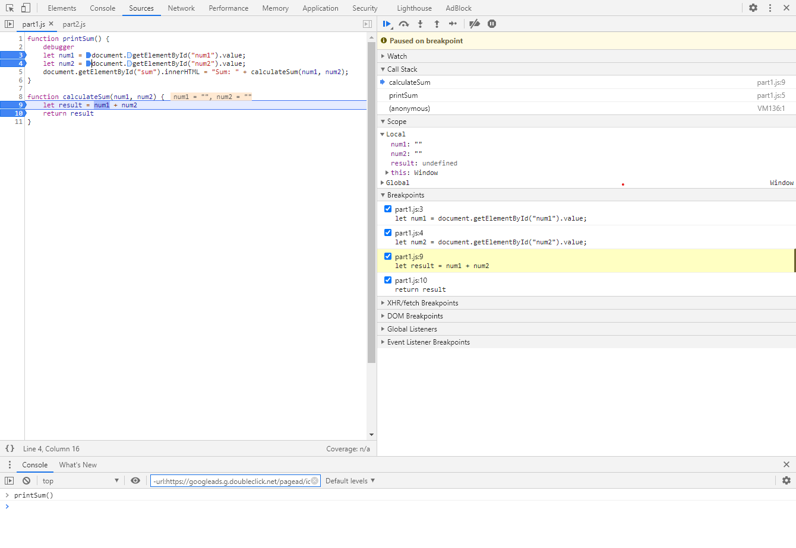
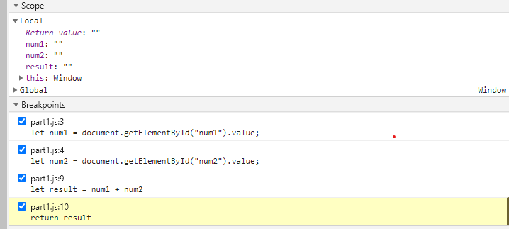
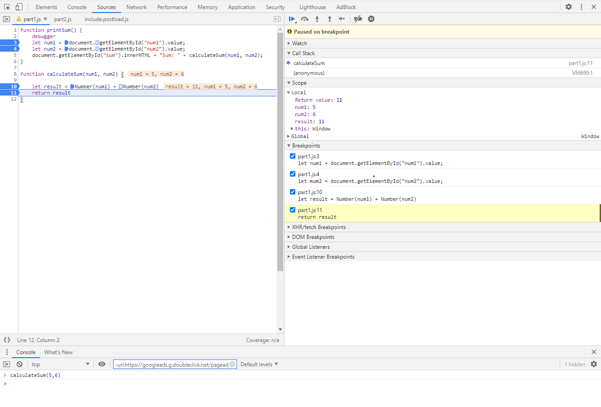
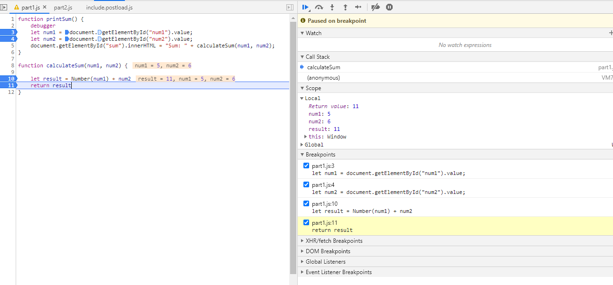
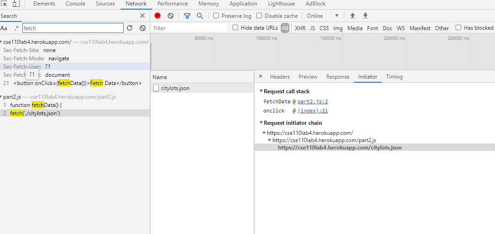
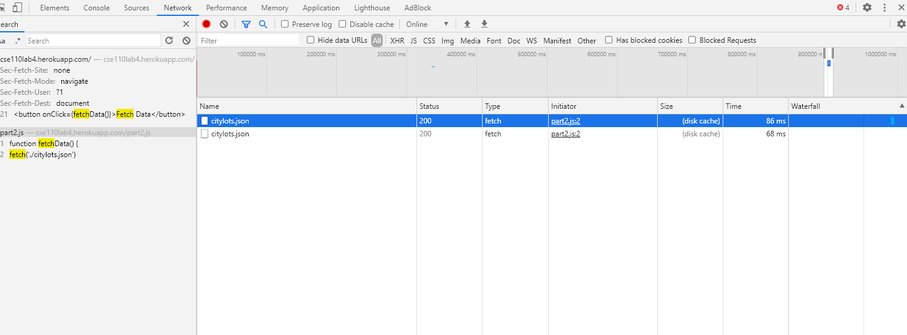
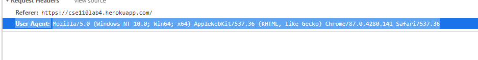
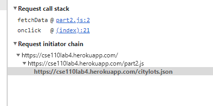

# DevTool Debugging

## How was the bug?







``` The bug is that it is taking num1 and num2 as strings and computing a concatenation instead of a summation of numbers.```


## How Would you fix it?


``` How I would fix it would be to change num1 and num2 into numbers```

***
***


``` This also seems to fix it to my desirable functionality but I kinda understand why its like that :/```


***
***

# DevTools - Network Tab



1.  The name of the new JSON file is citylots.json.


2.  part2.js initiated the call




3.  The filesize is 11.7 MB 

4.  It took approximately 77 ms to retrieve data.

5.  The User-Agent was Mozilla/5.0
    
6.  It came from Apache

7.  It was last modified Tue, 26 Jan 2021 22:14:13 GMT
    

8.  The content type was application/json
    

9.  The fetchData method made the request.
    